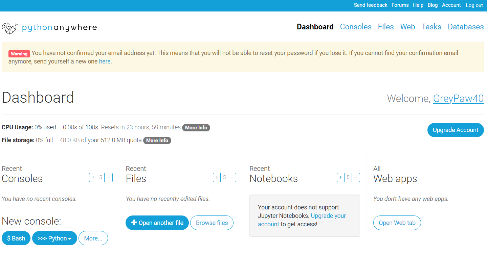

# Домашнее задание к занятию 3. Функции. Разработка приложения ToDo
## Задание 1
Реализуйте функцию `count_letter`, которая принимает список слов и некоторую букву и возвращает количество слов в списке, в которых эта буква встречается хотя бы один раз.

Например, для списка `['python', 'c++', 'c', 'scala', 'java']` и буквы `c` ваша функция должна вернуть число `3`.

Подсказки
- Используйте конструкцию for word in ... для итерации по списку.
- Используйте переменную для хранения промежуточного результата подсчета.
- Используйте конструкцию letter in word для проверки наличия буквы в слове.
## Решение:
```python
words = ['python', 'c++', 'c', 'scala', 'java']
my_letter = "c"


def count_letter(words, my_letter):
    letter_in_word = 0
    for word in words:
        if my_letter in word:
            letter_in_word += 1
    return letter_in_word


print(count_letter(words, my_letter))
```
## Задание 2
Зарегистрируйтесь на сайте https://www.pythonanywhere.com/.

## Инструкция
Инструкция по работе с PythonАnywhere доступна по ссылке: https://github.com/netology-code/guides/blob/master/python%20anywhere/instruction.md
## Решение:
 